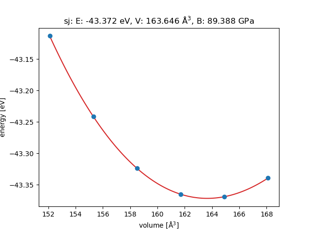
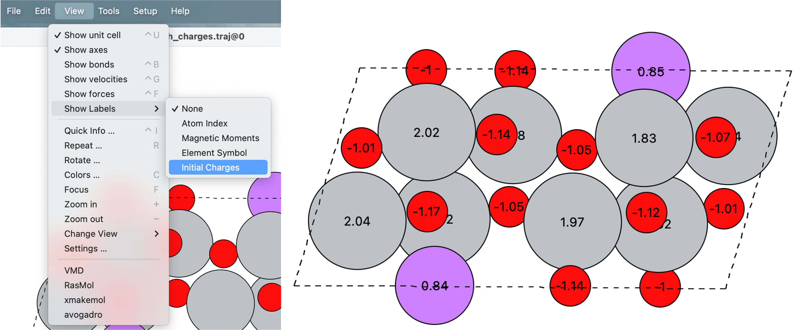
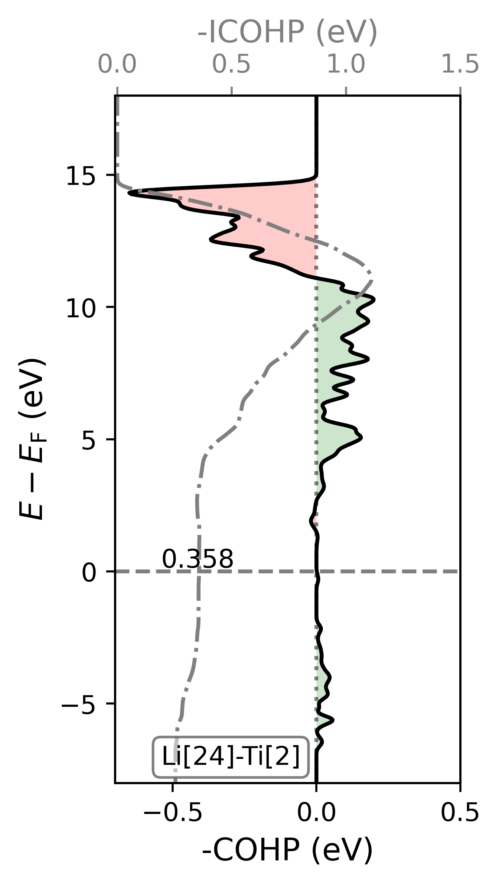
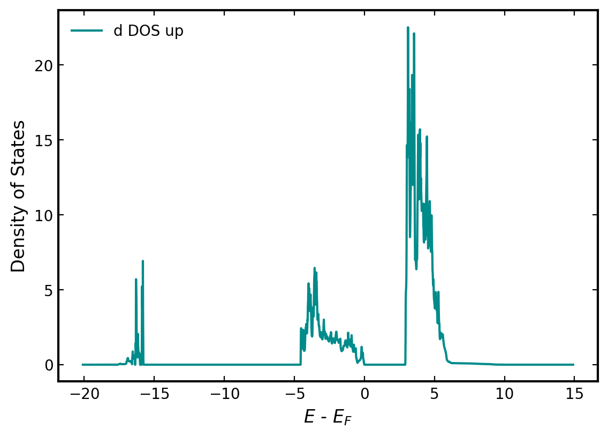
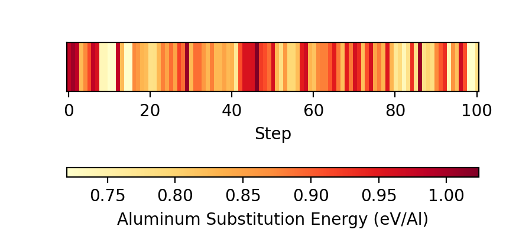
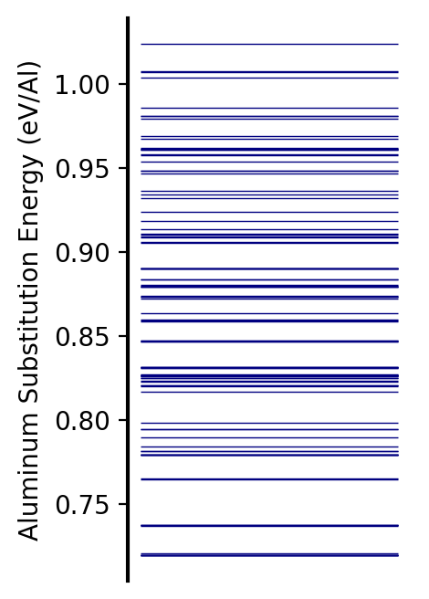

# Installation
Clone this repo using the following commands:
```
cd /path_to_home_directory/
git clone https://github.com/sreeharshab/scalar_codes.git
```
After successful cloning of the repo, open your `.bashrc` and insert this line:
```
export PYTHONPATH=/path_to_home_directory/scalar_codes:$PYTHONPATH
```
Exit your `.bashrc` and source it as follows:
```
source .bashrc
```
**Note**: Ensure that you have [Atomic Simulation Environment (ASE)](https://wiki.fysik.dtu.dk/ase/), [Numpy](https://numpy.org/), [Pandas](https://pandas.pydata.org/), [SciPy](https://scipy.org/) and [Matplotlib](https://matplotlib.org/) installed in your machine!

**Optional**: scalar_codes can be used as a package if `/path_to_home_directory/` is appended to `PYTHONPATH`.

# Resources
There are two parts to this repository. Part 1 is available in pipelines.py and part 2 is available in silicon.py.

Use `help(function/class)` to get detailed documentation about the resources. Furthermore, there are examples for some of the resources in the examples folder.

The defaults for all VASP related calculations are as follows:
`gga="PE",
lreal="Auto",
lplane=True,
lwave=False,
lcharg=False,
ncore=8,
prec="Normal",
encut=300,
ediff=1e-6,
algo="VeryFast",
ismear=-5,
gamma=True`  
You can change the defaults and add additional settings using `opt_levels` parameter for `geo_opt` and `surface_charging` and using `addnl_settings` parameter for all other calculations.

## Part 1: Automation Codes for VASP Related Calculations
1. cell_opt: Optimizes the size of the simulation cell and provides an equation of state plot.  
<div align="center">
    
</div>

2. axis_opt: Optimizes the size of the required axis of the simulation cell and provides and equation of state plot.
3. geo_opt: Performs geometry optimization on the system using inbuilt [VASP](https://www.vasp.at/wiki/index.php/The_VASP_Manual) optimizer (IBRION=2) or [ASE](https://wiki.fysik.dtu.dk/ase/)'s BFGS optimizer.
4. bader: Performs [bader charge analysis](https://theory.cm.utexas.edu/henkelman/code/bader/) on the system. Charges can be viewed in ACF.dat file or using ase gui and choosing the Initial Charges in the view tab as shown below.  
<div align="center">
    
</div>

5. COHP: Performs Crystal Orbital Hamilton Population analysis on the system using [LOBSTER](http://www.cohp.de/).  
<div align="center">
    
</div>

6. frequency: Performs vibrational analysis on the system using VASP or ASE. Use ASE for calculations involving large systems as it supports a parallel scheme.
7. surface_charging: Performs surface charging calculation using [VASPsol](https://github.com/henniggroup/VASPsol).
8. gibbs_free_energy: Gives the gibbs free energy of the system. If surface_charging is used, the parabola fit is used to obtain the energy vs potential. If geo_opt is used, OUTCAR is used to obtain energy. The vibrational energy is obtained using the frequency class. These energies can be used in [PyEnergyDiagrams](https://github.com/giacomomarchioro/PyEnergyDiagrams) to generate reaction pathways. Follow the following folder structure for the calculations to process the data accurately:  
<div align="center">
    
</div>

9. DOS: Performs a DOS calculation and parses the DOSCAR to get total and projected DOS.  
<div align="center">
    
</div>

10. analyse_GCBH: Performs a visual analysis of the results from Grand Canonical Basin Hopping simulation performed using [catalapp](https://github.com/GengSS/catalapp?tab=readme-ov-file). The following images are obtained from Bhimineni, S. H.; Ko, S.-T.; Cornwell, C.; Xia, Y.; Tolbert, S. H.; Luo, J.; Sautet, P. First Principles Study of Aluminum Doped Polycrystalline Silicon as a Potential Anode Candidate in Li-ion Batteries. *Advanced Energy Materials* **2024**, 2400924, [(https://doi.org/10.1002/aenm.202400924)](https://doi.org/10.1002/aenm.202400924).
<div align="center">
    
    
</div>

11. get_neighbor_list: Provides the neigbor list for the system. Output is provided in Neighbor_List.txt file. Neighbors of each atom, their positions and coordination numbers of each atom are provided based on ASE's natural cutoff distances.
12. check_run_completion: Checks for completion of a VASP job at the provided location.
13. benchmark: Performs computational benchmark of a VASP job.

## Part 2: Codes to Study Silicon Systems
14. create_sigma3_gb: Creates a Σ3 grain boundary with n layers using top_grain.vasp and bottom_grain.vasp files (available in the examples folder).
15. slide_sigma3_gb: Slides Σ3 grain boundary. Serial and parallel runs are implemented. In each run, step and linear schemes are implemented. Note that step scheme is effective for studying the stick-slip sliding behavior and linear scheme is effective for studying elastic deformation.
16. intercalate_Li: Inserts Li in all the interstice positions of Σ3 grain boundary.
17. symmetrize_Si100_surface: Symmetrizes Si (100) strcuture along z axis. This is necessary to perform surface charging calculations using [VASPsol](https://github.com/henniggroup/VASPsol).
18. cure_Si_surface_with_H: In order to study Si surfaces, it is essestial to create a bulk like environment far from the surface. To create this environment, we need to add hydrogens to our surface model (with vacuum) to cure the dangling bonds. This code inserts works best for (100) Si surface where it inserts two hydrogens if the coordination of silicon is less than four.

## Citing
If you use scalar_codes in your research, please cite the following paper:  
Bhimineni, S. H.; Ko, S.-T.; Cornwell, C.; Xia, Y.; Tolbert, S. H.; Luo, J.; Sautet, P. First Principles Study of Aluminum Doped Polycrystalline Silicon as a Potential Anode Candidate in Li-ion Batteries. *Advanced Energy Materials* **2024**, 2400924, [(https://doi.org/10.1002/aenm.202400924)](https://doi.org/10.1002/aenm.202400924).